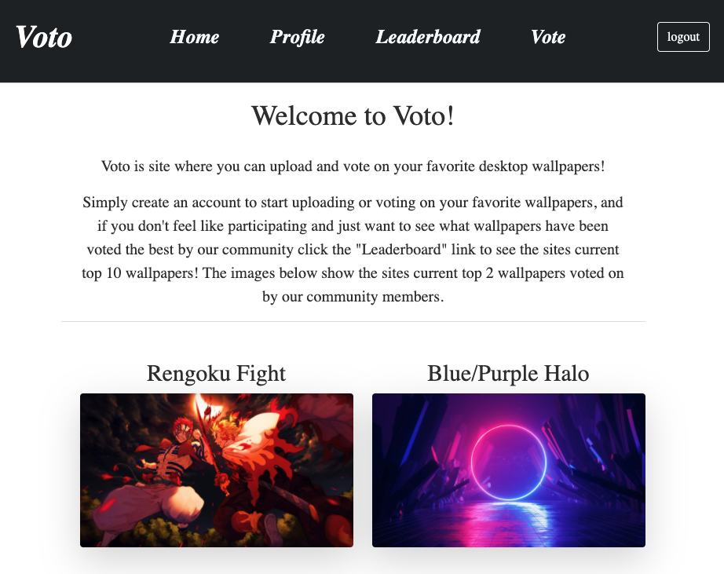

# Voto
A website for storing and voting on your favorite wallpapers

## Table of Contents
* [Description](#description)
* [Technologies](#technologies)
* [Link](#link)
* [Contributors](#contributors)
* [Contact](#contact)
* [Repo](#repo)

## Description
Voto is a site where you can upload and vote on your favorite desktop wallpapers!

Simply create an account to start uploading or voting on your favorite wallpapers, and if you don't feel like participating and just want to see what wallpapers have been voted the best by our community click the "Leaderboard" link to see the sites current top 10 wallpapers! The images below show the sites current top 2 wallpapers voted on by our community members. 

## Languages
* Javascript
* CSS
* Express.js
* Sequelize
* MySQL2
* Handlebars
* ESlint
* HTML

## Link
* [https://dry-shelf-93414.herokuapp.com/](https://dry-shelf-93414.herokuapp.com/)

## Contributors
* Amir Bahmani
* Alan Lin
* Adam Burpee

## Contact
* Amir: amirb2467@gmail.com
* Alan: alin6120404@gmail.com
* Adam: arburpee@gmail.com

## Repo
* [Github](https://github.com/amirb97/desktop-wallpaper-voting-site)